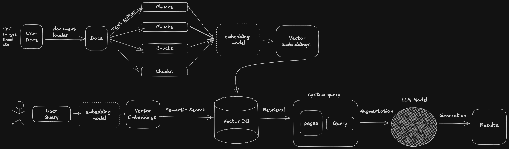

Simple RAG
==========

A lightweight Retrieval-Augmented Generation (RAG) project that loads local documents, builds a FAISS vector index with sentence-transformer embeddings, and summarizes relevant chunks using a Groq-hosted LLM via LangChain.

Features
--------
- Loads PDFs, TXT, CSV, Excel, Word, and JSON files from `data/`
- Splits documents into chunks and generates embeddings
- Persists a FAISS index + metadata to `faiss_store/`
- Runs retrieval + summarization with Groq LLM

Project Layout
--------------
- `app.py`: Example RAG workflow (load/build index + summarize)
- `src/data_loader.py`: Multi-format document loader
- `src/embedding.py`: Chunking + embedding pipeline
- `src/vectorstore.py`: FAISS vector store with persistence
- `src/search.py`: Retrieval + LLM summarization
- `data/`: Place your source documents here
- `faiss_store/`: Saved FAISS index + metadata

Architecture
------------


Setup
-----
Requirements: Python 3.11

Create a virtual env and install deps:
```bash
python -m venv .venv
source .venv/bin/activate
pip install -r requirements.txt
```

Environment
-----------
This project uses Groq for LLM inference. Set your API key in `.env`:
```
GROQ_API_KEY=your_key_here
```
Note: `src/search.py` currently initializes `ChatGroq` with a blank key. Update it to read from `GROQ_API_KEY` or pass your key directly.

Usage
-----
1) Add documents to `data/`
2) Build or load the index + summarize:
```bash
python app.py
```

If you only want to build the vector store:
```bash
python -m src.vectorstore
```

If you only want to test embeddings:
```bash
python -m src.embedding
```

If you only want to load documents:
```bash
python -m src.data_loader
```

Notes
-----
- The FAISS index is stored in `faiss_store/faiss.index` and metadata in `faiss_store/metadata.pkl`.
- Default embedding model: `all-MiniLM-L6-v2`.
- Default LLM model: `llama-3.1-8b-instant`.

Issues
------
On macOS 26 with Python 3.14, `chromadb` can install an older version (due to missing `onnxruntime`), which may omit the `chroma` CLI and cause dependency conflicts. Using Python 3.11 avoids this for now.
